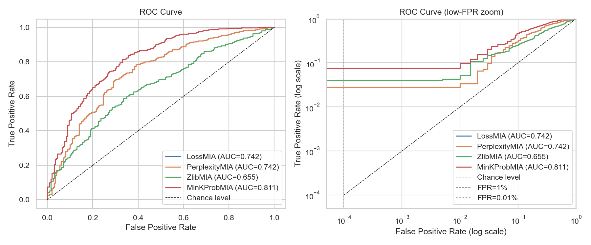
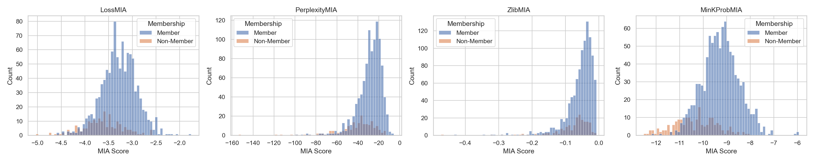

# Audit MIA — GPT-2 fine-tuné sur IMDB

## Metadata

### Operator Metadata

| | |
|---|---|
| **Generated_by** | Gigalis |

### Execution Metadata

| | |
|---|---|
| **Used Paname commit** | 414b1753542c8a7edc957cb943e9aa1fdf37ea2d |
| **Report generation date** | 2026-05-19 |
| **Random state** | 42 |

### Use-case Metadata

| | |
|---|---|
| **Target model** | GPT-2 fine-tuned IMDB |
| **Model wrapper** | Model Wrapper not specified |
| **Audit set** | 1200 samples (1000 members / 200 non-members) |

## Metrics

| MIA | AUC | TPR@1% | TPR@0.01% |
|--------|--------|--------|--------|
| LossMIA | 0.7415 | 0.0340 | 0.0280 |
| PerplexityMIA | 0.7415 | 0.0340 | 0.0280 |
| ZlibMIA | 0.6551 | 0.0520 | 0.0400 |
| MinKProbMIA | 0.8113 | 0.0990 | 0.0750 |

- **AUC**: Illustrates the performance of the classifier : formally, it is the area under the TPR@FPR curve for different values of FPR. Probabilistically, one can interpret that as the probability, given a {member, non-member} pair, that the mia score of the member is higher than the mia score of the non-member
- **TPR@1%**: Fraction of members that are classified as such when choosing an operating point where only 1% of actual non-members are classified as members
- **TPR@0.01%**: Fraction of members that are classified as such when choosing an operating point where only 0.01% of actual non-members are classified as members

## ROC Curves

## Score Distributions

